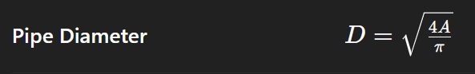
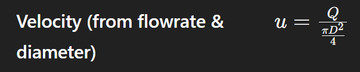

# 🛠️ Pipe Sizing Calculator

This Python application calculates the **pipe diameter** or **flow velocity** based on user input. It supports both **liquid** and **gas** flows and follows standard process engineering guidelines from McCabe, Smith, and Coulson & Richardson.

---

## ✅ Features

- Supports two modes:
  - 📐 Calculate Pipe Diameter from Flowrate & Velocity
  - 💨 Calculate Flow Velocity from Flowrate & Pipe Diameter
- Select fluid type: **Liquid** or **Gas**
- Engineering warning notes based on flow velocity range
- Clean CLI interface
- Unit conversions via `unit_conversions.py`

---

## 🔍 Why It Matters

Correct pipe sizing ensures:

- ✅ Efficient fluid transport  
- ✅ Avoids excessive pressure drops  
- ✅ Prevents erosion, cavitation, or sedimentation  
- ✅ Minimizes energy consumption (pump/compressor duty)

---

## 🧮 Engineering Formulas Used

From fluid mechanics and continuity principles:

### Pipe Diameter:

### Flow Velocity:


Where:
- \( Q \) = Volumetric flowrate (converted from m³/h to m³/s)  
- \( u \) = Velocity [m/s]  
- \( D \) = Pipe inner diameter [m]

---

## 📘 Reference Books

- McCabe, W.L., Smith, J.C., and Harriott, P. – *Unit Operations of Chemical Engineering*, 7th Ed.
- Coulson & Richardson – *Chemical Engineering Volume 1*, 6th Ed.
- Perry’s Chemical Engineers' Handbook – 8th Ed.

---

## 💡 Recommended Velocity Ranges

| Fluid | Recommended Velocity |
|-------|-----------------------|
| Liquid | 1 – 10 m/s |
| Gas    | 10 – 40 m/s |

> Speeds above these may cause erosion/noise. Below range = poor transport or settling.

---

## 🚀 How to Run

```bash
python pipe_sizer.py
